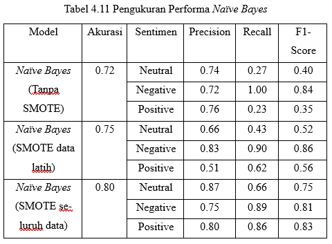
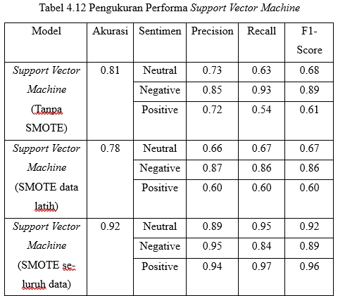
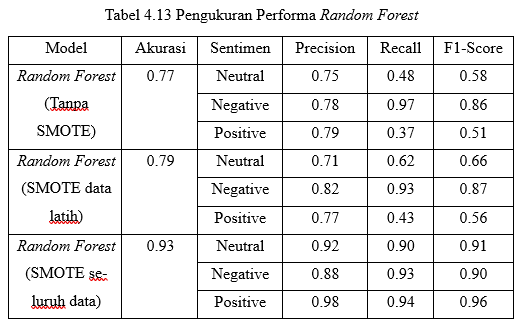

# 📊 Sentiment Analysis with SMOTE Strategy Evaluation on Twitter Data

This project analyzes public sentiment toward the **Danantara program** using data collected from platform X (Twitter).  
The study focuses on handling imbalanced data using **SMOTE** and evaluating how different SMOTE strategies affect model performance.
---
This project not only builds sentiment classification models, but also evaluates the impact of SMOTE placement and highlights potential data leakage issues in machine learning pipelines.

---

## 🚀 Project Highlights

- Analyzed **10,506 tweets** from Twitter (X)
- Applied **TF-IDF feature extraction**
- Compared 3 machine learning models:
  - Naive Bayes
  - Support Vector Machine (SVM)
  - Random Forest
- Evaluated 3 SMOTE strategies:
  - Without SMOTE
  - SMOTE before train-test split
  - SMOTE after train-test split
- Identified **data leakage issue** in improper SMOTE usage

---

## 🎯 Objective

- Analyze public sentiment toward the Danantara program
- Handle class imbalance using SMOTE
- Compare model performance across different SMOTE scenarios
- Evaluate the impact of SMOTE placement in machine learning pipelines

---

## 🧾 Dataset

- Source: Twitter (X)
- Period: February – March 2025
- Total Data: **10,506 tweets**
- Method: Web scraping using Twikit

---

## ⚙️ Tech Stack

- Python
- Pandas, NumPy
- Scikit-learn
- Imbalanced-learn (SMOTE)
- Matplotlib, Seaborn
- NLTK

---

## 🔄 Workflow

1. Data Collection (Twitter Scraping)
2. Data Preprocessing
   - Text cleaning
   - Tokenization
   - Stopword removal
3. Feature Extraction (TF-IDF)
4. Handling Imbalanced Data (SMOTE)
5. Model Training
6. Model Evaluation

---

## 📊 Model Evaluation Results

This section compares model performance across three scenarios:

1. Without SMOTE  
2. SMOTE before train-test split  
3. SMOTE after train-test split  

---

### 🧠 Naive Bayes


---

### ⚙️ Support Vector Machine (SVM)


---

### 🌲 Random Forest


---

## 💡 Key Insights

- Applying SMOTE **before train-test split leads to inflated performance** due to data leakage.
- The most reliable evaluation is achieved when SMOTE is applied **after splitting the data**.
- Without SMOTE, models struggle to correctly classify minority classes.
- Random Forest achieved the highest performance when using proper SMOTE handling.
- Proper handling of imbalanced data significantly improves classification results.

---

## 🚀 How to Run

```bash
pip install -r requirements.txt

Run the notebooks in order:

Data Collection
Data Preprocessing
Modeling
